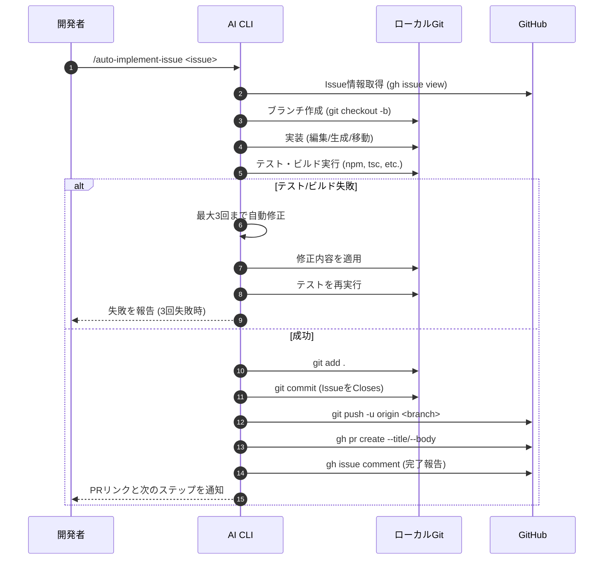
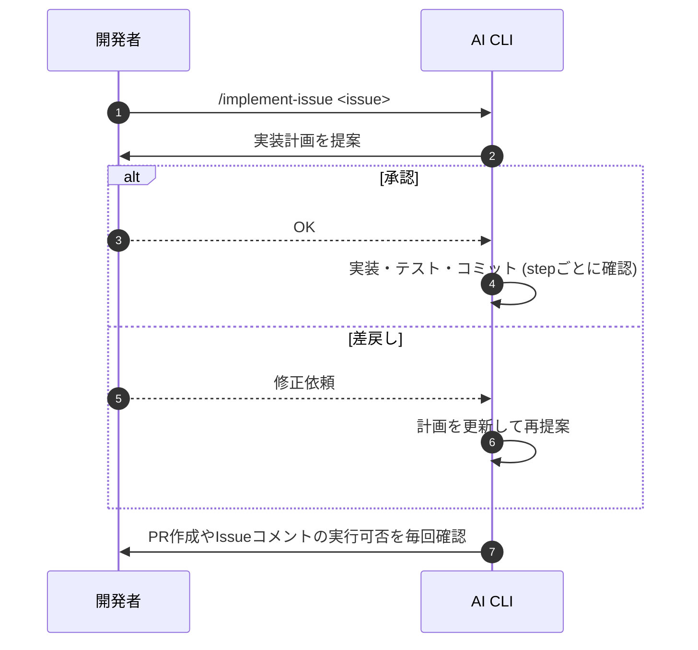
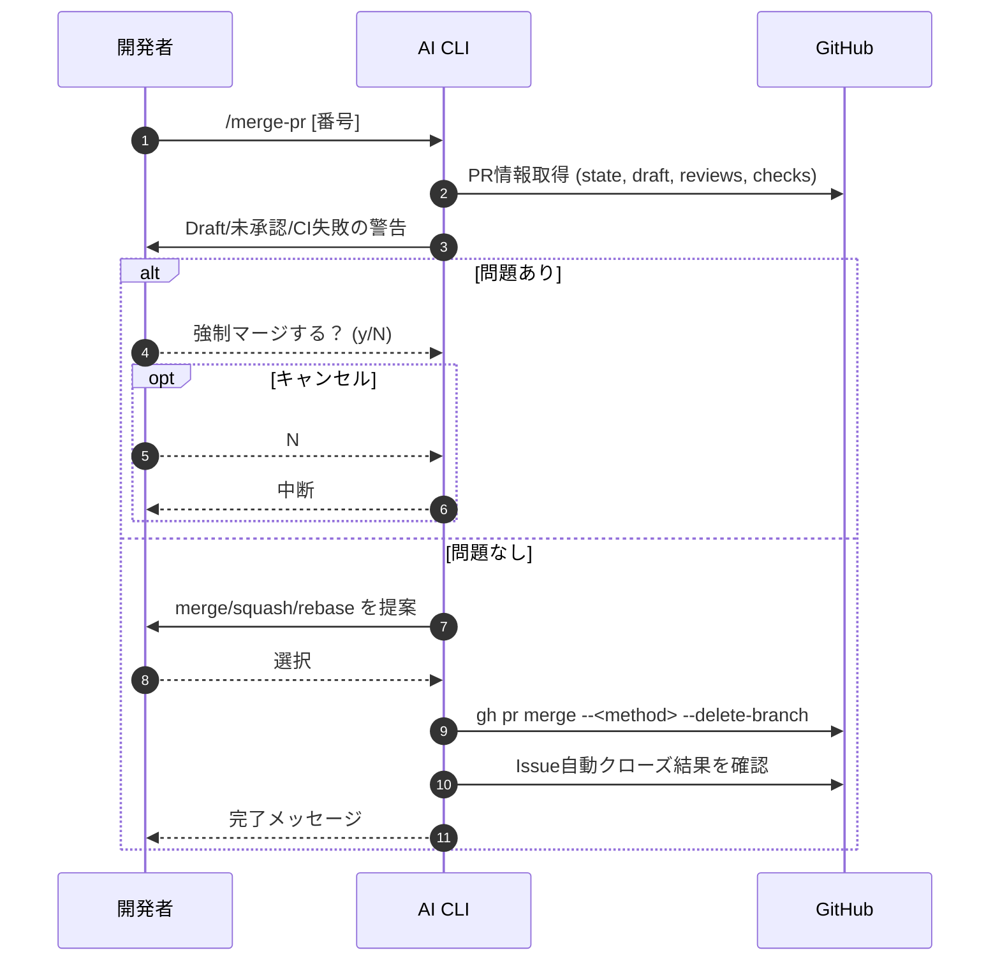

# スキル活用シーケンス図

開発で利用できる主要スキルのフローと条件分岐を視覚化しました。Issue駆動の全自動フローから、ブランチ作成・PR作成・マージ時のチェックまでを 1 つのドキュメントで把握できます。

## 1. `/auto-implement-issue` 完全自動フロー

Issue番号だけ指定すれば、実装からPR作成・Issueコメントまでを全自動で行うシーケンス図です。



## 2. `/implement-issue`（半自動）との比較

`/implement-issue` は途中でユーザー確認が入る以外、上記とほぼ同じ流れです。以下の図は「確認あり」の分岐を表しています。



## 3. スキル選択フローチャート（条件分岐）

タスクの規模や確認の要否に応じて、どのスキルを選ぶべきかをまとめています。

```mermaid
flowchart TD
    Start([作業開始]) --> Issue{Issueはある？}
    Issue -->|Yes| Size{変更規模は？}
    Issue -->|No| Manual[/cxb → 編集 → cxc/cxcp → cxpr → cxm/]

    Size -->|小 (1-2ファイル)| Auto[/auto-implement-issue/]
    Size -->|中 (3-10ファイル)| Choice{確認は必要？}
    Size -->|大 (10ファイル以上)| Manual

    Choice -->|Yes| Implement[/implement-issue/]
    Choice -->|No| Auto

    Manual --> Done([PR & Issue 更新])
    Auto --> Done
    Implement --> Done
```

## 4. `/merge-pr` のマージ前チェック

PRをマージする際の自動チェックと分岐を表したシーケンス図です。



## 5. ドキュメントの使い方

1. タスク開始時に **セクション3** のフローチャートでスキルを選ぶ。
2. 選んだスキルの詳細フロー（セクション1,2,4）を参照し、どの工程が自動化されているか把握する。
3. レビュー時は、図を見ながら「どのステップで問題が起きたか」「自動修正の上限に達したか」を共有するとスムーズです。

必要に応じて、今後は `/resume-session` や `/branch-name-helper` など他スキルの図も追記できます。
